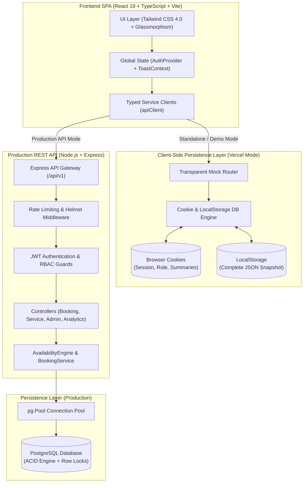
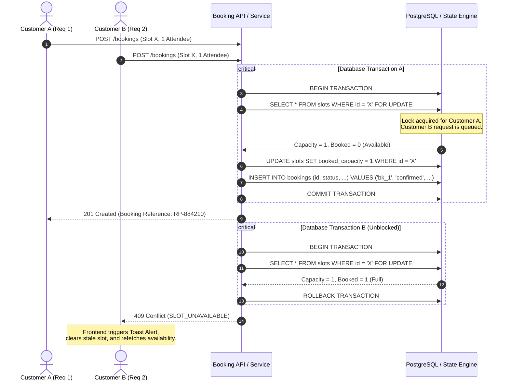
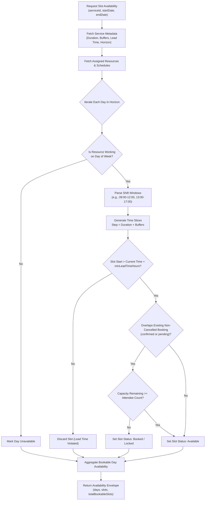

# ReservePulse

<div align="center">


### Resilient Multi-Tier Reservation & Resource Orchestration Platform
*Enterprise scheduling, ACID-compliant concurrency, real-time availability calculation, configurable intake forms, and zero-backend client-side cookie database persistence.*

[](https://vitejs.dev/)
[](https://react.dev/)
[](https://www.typescriptlang.org/)
[](https://nodejs.org/)
[](https://www.postgresql.org/)
[](https://tailwindcss.com/)
[](https://opensource.org/licenses/MIT)

</div>

---

## 📌 Table of Contents
1. [The Problem Statement](#-the-problem-statement)
2. [The Solution: ReservePulse](#-the-solution-reservepulse)
3. [System Architecture & Data Flow](#-system-architecture--data-flow)
4. [Engineering Flowcharts](#-engineering-flowcharts)
   - [ACID Concurrency & Double-Booking Prevention](#1-acid-concurrency--double-booking-prevention-flow)
   - [Dynamic Availability Engine Flow](#2-dynamic-availability-engine-flow)
   - [Role-Based Access Control (RBAC) Hierarchy](#3-role-based-access-control-rbac-hierarchy)
5. [Deep Feature Breakdown](#-deep-feature-breakdown)
   - [Dual-Mode Architecture & Cookie Database Engine](#1-dual-mode-architecture--cookie-database-engine)
   - [Real-Time Slot Availability & Collision Engine](#2-real-time-slot-availability--collision-engine)
   - [Configurable Intake Questionnaires](#3-configurable-intake-questionnaires)
   - [Resilient State Machine & PCI-Compliant Abstraction](#4-resilient-state-machine--pci-compliant-abstraction)
   - [Operational Telemetry & Real-Time Analytics](#5-operational-telemetry--real-time-analytics)
   - [Enterprise Admin Governance & Audit Logging](#6-enterprise-admin-governance--audit-logging)
6. [Interactive Demo Accounts & Testing Sandbox](#-interactive-demo-accounts--testing-sandbox)
7. [Directory Structure](#-directory-structure)
8. [Getting Started & Local Development](#-getting-started--local-development)
9. [Deployment Guide (Vercel & Cloud Hosting)](#-deployment-guide-vercel--cloud-hosting)

---

## ⚠️ The Problem Statement

Traditional reservation and appointment systems collapse under high concurrency and complex resource constraints. Across modern platforms, five recurring architecture failures undermine operational integrity:

1. **The Double-Booking Race Condition**: High-demand slots (e.g., meeting rooms, GPU compute slices, medical consultations) receive concurrent HTTP requests within milliseconds. Naive `SELECT` followed by `UPDATE` queries suffer from race windows where two requests read capacity as available and both write bookings, resulting in catastrophic over-allocation.
2. **State Fragmentation & Zombie Locks**: When a booking or payment workflow drops mid-stream (network drops, abandoned tabs), slots frequently remain locked in limbo, artificially depleting bookable inventory.
3. **Rigid Intake Schemas**: Most scheduling tools force fixed form fields. When organizers need dynamic, per-service questions (e.g., NDA sign-offs, PyTorch framework tags, catering dietary choices), developers are forced to write bespoke database schema migrations.
4. **Brittle Availability Mathematics**: Calculating availability requires factoring in operating windows, split shifts, variable buffer times before and after appointments, minimum advance notice, and maximum forward scheduling horizons. Naive date math leads to time-drift bugs and timezone discrepancies.
5. **Deployment & Evaluation Friction**: Reviewers, testers, and recruiters often cannot preview a full-stack booking system without spinning up external cloud databases, running SQL migrations, and configuring environment secrets.

---

## 💡 The Solution: ReservePulse

ReservePulse is an enterprise-grade reservation and resource orchestration platform engineered from the ground up to solve concurrency, schema rigidity, and operational friction:

- **ACID-Compliant Concurrency**: Uses PostgreSQL transactional row-level locks (`SELECT ... FOR UPDATE`) to guarantee that concurrent booking attempts for the same resource slot are processed serially. Exactly one request succeeds while competing bursts receive an immediate `409 Conflict` with clear recovery guidance.
- **Dual-Mode Deployment Engine**:
  - **Production Mode**: Full-stack Node.js/Express + PostgreSQL with connection pooling and raw SQL migrations.
  - **Zero-Backend Standalone Mode**: An in-browser **Cookie & LocalStorage Database Engine** with a transparent client-side mock router. This enables 100% of the platform (bookings, catalog management, intake questions, admin governance, and telemetry) to run directly on **Vercel** with zero external database dependencies!
- **Dynamic Real-Time Slot Engine**: Evaluates weekly resource schedules, split shifts, custom before/after buffer intervals, minimum lead times, and active capacity dynamically.
- **Configurable Intake Forms**: Organisers can create custom questionnaires (text, textarea, select, checkbox, radio) on a per-service basis. Responses are validated and immutably archived with the booking ledger.
- **Role-Based Access Control (RBAC)**: Fine-grained segmentation across **Customer**, **Organiser**, and **Platform Administrator** tiers, complemented by a 1-click testing sandbox and autofill credentials system.

---

## 🏗️ System Architecture & Data Flow



---

## 📊 Engineering Flowcharts

### 1. ACID Concurrency & Double-Booking Prevention Flow

When multiple users attempt to book the final available slot simultaneously, ReservePulse guarantees zero double-bookings through serializable transactions and row-level locking:



---

### 2. Dynamic Availability Engine Flow

The availability engine dynamically generates and validates bookable slots across complex operating calendars:



---

### 3. Role-Based Access Control (RBAC) Hierarchy

ReservePulse enforces strict role boundaries across three tiers:

```mermaid
graph TD
    classDef customer fill:#ECFDF5,stroke:#059669,stroke-width:2px;
    classDef organiser fill:#F0FDFA,stroke:#0D9488,stroke-width:2px;
    classDef admin fill:#F5F3FF,stroke:#7C3AED,stroke-width:2px;

    User["Authenticated User Profile"] --> RoleCheck{"Inspect Role"}

    RoleCheck -->|Role: CUSTOMER| CustPortal["Customer Portal"]:::customer
    RoleCheck -->|Role: ORGANISER| OrgPortal["Organiser Workspace"]:::organiser
    RoleCheck -->|Role: ADMIN| AdminPortal["Platform Governance"]:::admin

    subgraph CustomerPrivileges["Customer Permissions"]
        CustPortal --> C1["Browse Catalog & Previews"]
        CustPortal --> C2["Calculate Dynamic Slots"]
        CustPortal --> C3["Submit Intake Answers"]
        CustPortal --> C4["Track Personal Bookings"]
        CustPortal --> C5["Cancel Self Reservations"]
    end

    subgraph OrganiserPrivileges["Organiser Permissions"]
        OrgPortal --> O1["Draft & Publish Services"]
        OrgPortal --> O2["Manage Physical & Compute Resources"]
        OrgPortal --> O3["Define Weekly Shifts & Buffers"]
        OrgPortal --> O4["Build Custom Intake Forms"]
        OrgPortal --> O5["Confirm or Reschedule Bookings"]
    end

    subgraph AdminPrivileges["Administrator Permissions"]
        AdminPortal --> A1["Platform-Wide Telemetry & KPIs"]
        AdminPortal --> A2["User Role Promotion / Demotion"]
        AdminPortal --> A3["Cross-Tenant Booking Oversight"]
        AdminPortal --> A4["System-Wide Audit Log Inspection"]
        AdminPortal --> A5["Protected Governance (Self-Demotion Guard)"]
    end
```



---

## 🔍 Deep Feature Breakdown

### 1. Dual-Mode Architecture & Cookie Database Engine
ReservePulse features an innovative **Dual-Mode Persistence Architecture** that allows the entire web application to run completely standalone on frontend hosts like Vercel, while remaining 100% compatible with production PostgreSQL backends:

- **In-Browser Cookie & LocalStorage Database**: State is maintained client-side via a reactive storage manager (`cookieDb.ts`). Active session tokens, user profiles, services count, and bookings are written to browser cookies (`rp_auth_token`, `rp_auth_user`, `rp_user_role`, `rp_db_stats`), while complete JSON models are synchronized to `localStorage`.
- **Zero-Latency Mock API Router**: An intelligent interceptor (`mockRouter.ts`) captures standard REST calls (`/auth/*`, `/services/*`, `/bookings/*`, `/resources/*`, `/admin/*`, `/analytics/*`, `/health`) and fulfills them in-memory with simulated async delays, allowing loading spinners and micro-animations to render realistically.
- **Persistence Across Sessions**: Any booking created, service published, or role modified persists across page refreshes and browser restarts without a single database error!
- **1-Click Seed Reset**: Testers can restore the entire application back to its clean initial seed state at any time via the "Reset Sample Data" button.

---

### 2. Real-Time Slot Availability & Collision Engine
- **Configurable Service Durations & Buffer Times**: Supports before/after buffers (e.g., 15 minutes preparation, 15 minutes room cleanup) to prevent back-to-back overlaps.
- **Scheduling Horizons & Minimum Lead Time**: Prevents customers from booking past the allowable booking window (e.g., 30 days in advance) or booking on too-short notice (e.g., minimum 2 hours lead time).
- **Split-Shift Operating Hours**: Supports resources operating across multiple shift windows in a single day (e.g., 09:00–12:00 and 13:30–18:00).
- **Collision Detection**: Real-time evaluation against confirmed and pending reservations guarantees that slots display accurate remaining capacities.

---

### 3. Configurable Intake Questionnaires
- **Dynamic Field Types**: Organisers can create custom questionnaires per service supporting `text`, `textarea`, `select`, `checkbox`, and `radio`.
- **Validation & Requirements**: Backend validators and frontend forms enforce mandatory responses before booking submission.
- **Immutable Ledger Archival**: Answers are permanently stored alongside the booking record, ensuring historical audit integrity even if the service questionnaire is modified later.

---

### 4. Resilient State Machine & PCI-Compliant Abstraction
- **Booking Lifecycle**:
  $$\text{Draft} \longrightarrow \text{Pending} \longrightarrow \text{Confirmed} \longrightarrow \text{Completed}$$
  $$\text{Pending / Confirmed} \longrightarrow \text{Cancelled (Releases Capacity)}$$
- **Zero Cardholder Data Storage**: Strict PCI-DSS compliant design. No raw PAN, CVV, or card data is ever handled by backend servers. Built-in payment abstraction interfaces (`IPaymentProvider`) support drop-in Stripe or Adyen payment intent integration.

---

### 5. Operational Telemetry & Real-Time Analytics
- **Executive KPI Dashboard**: Total volume, confirmed revenue, completion rate, and active resources.
- **Timeline Trends**: Volume aggregations grouped by day or hour to track demand patterns.
- **24-Hour Peak Load Heatmap**: Identifies peak operational windows (e.g., busiest hours between 02:00 PM – 04:00 PM).
- **Resource Fleet Utilization**: Granular breakdown of booked minutes vs. available shift minutes per resource.

---

### 6. Enterprise Admin Governance & Audit Logging
- **User Administration**: Activate/deactivate accounts, inspect user bookings, and promote roles between Customer, Organiser, and Admin.
- **Self-Preservation Guards**: Admins cannot accidentally deactivate their own accounts or demote themselves, preventing administrative lockouts.
- **Immutable Audit Trail**: Chronological event logging tracks user logins, booking creations, service publications, and permission updates with timestamped metadata.

---

## 🔑 Interactive Demo Accounts & Testing Sandbox

The sign-in page features an interactive **2-Column Testing Sandbox** with 1-click autofill for instant evaluation:

| Persona | Role | Email | Password | Primary Capabilities to Test |
| :--- | :--- | :--- | :--- | :--- |
| **Alex Morgan** | `CUSTOMER` | `customer@reservepulse.com` | `Customer@123` | Public catalog browsing, availability calendar, custom intake questionnaires, and booking confirmation. |
| **Jordan Vance** | `ORGANISER` | `organiser@reservepulse.com` | `Organiser@123` | Service catalog drafting, workspace/compute resource management, shift planning, and reservation approval. |
| **Morgan Reed** | `ADMIN` | `admin@reservepulse.com` | `Admin@123` | Platform analytics, user administration, role promotion, system audit logs, and global booking inspection. |

> [!TIP]
> **Flexible Testing**: You can also enter **any custom email and password** on the login page; the in-browser engine will generate an account on the fly so you can test any custom scenario!

---

## 📁 Directory Structure

```text
ReservePulse/
├── frontend/                         # Single-Page Application (React 19 + TypeScript + Vite)
│   ├── src/
│   │   ├── components/               # UI components, layout shells, booking wizard, tables, toasts
│   │   │   ├── auth/                 # Protected route wrapper & auth guards
│   │   │   ├── booking/              # Multi-step booking wizard with live slot synchronization
│   │   │   ├── common/               # Header, Footer, ErrorBoundary, Modals, EmptyState
│   │   │   └── ui/                   # Button, Card, Input, Badge, Table, Toast design system
│   │   ├── context/                  # AuthProvider, ToastContext, global session management
│   │   ├── pages/                    # Route views (HomePage, Services, Booking, Admin, Analytics)
│   │   │   └── auth/                 # Redesigned 2-column split LoginPage, SignupPage, OTP
│   │   ├── services/                 # API clients, mock router, typed HTTP adapters
│   │   │   ├── api.ts                # Master API client with transparent CookieDB fallback
│   │   │   └── mockRouter.ts         # In-browser REST router handling all endpoints
│   │   ├── utils/                    # Date helpers, formatters, slot math
│   │   │   └── cookieDb.ts           # Client-side Cookie & LocalStorage database engine
│   │   └── App.tsx                   # Central client router with role-based layout nesting
│   ├── package.json
│   ├── vercel.json                   # Vercel SPA routing rewrites
│   └── vite.config.ts
│
├── backend/                          # High-Concurrency REST API (Node.js + Express + TypeScript)
│   ├── src/
│   │   ├── config/                   # PostgreSQL pool, environment config, JWT signing
│   │   ├── controllers/              # Route handlers (Auth, Booking, Admin, Analytics, Health)
│   │   ├── middleware/               # RBAC guards, request logging, error middleware, rate limiting
│   │   ├── services/                 # AvailabilityEngine, BookingService, ResourceService
│   │   ├── validators/               # Zod input validation schemas
│   │   ├── app.ts                    # Express application pipeline & CORS configuration
│   │   └── server.ts                 # HTTP server lifecycle & graceful shutdown
│   └── package.json
│
├── database/                         # Database Migration & Persistence Assets
│   ├── migrations/                   # Chronological SQL migrations (001 - 008)
│   └── seed/                         # Deterministic development seed dataset
│
├── docs/                             # Engineering Architecture & Reference Manuals
│   ├── api.md                        # Comprehensive REST API v1 endpoint specifications
│   ├── architecture.md               # Detailed architectural blueprints & data flow models
│   ├── availability.md               # Availability engine mathematics & collision detection
│   ├── database.md                   # Schema reference, constraints & entity relationship diagrams
│   └── setup.md                      # Developer installation & production deployment guide
│
├── vercel.json                       # Root Vercel deployment orchestration
├── package.json                      # Monorepo root orchestration scripts
└── README.md                         # Platform documentation
```

---

## 💻 Getting Started & Local Development

### Prerequisites
- **Node.js**: `>= 18.0.0`
- **npm**: `>= 9.0.0`
- **PostgreSQL** *(optional for full-stack mode)*: `>= 15.0`

### 1. Clone the Repository
```bash
git clone https://github.com/rudartrivedi29/ReservePulse.git
cd ReservePulse
```

### 2. Install Dependencies
```bash
npm run install:all
```

### 3. Run Standalone Frontend (Zero Database Required)
To run the frontend powered by the in-browser **Cookie Database Engine**:
```bash
npm run dev:frontend
```
Open **[http://localhost:5173](http://localhost:5173)** in your browser. All booking, service creation, admin, and authentication flows work out of the box!

### 4. Run Full-Stack Mode (Express + PostgreSQL)
```bash
# 1. Copy environment template
cp .env.example .env

# 2. Start PostgreSQL and run migrations
npm run migrate --prefix backend

# 3. Start concurrently (Backend on :5000, Frontend on :5173)
npm run dev
```

---

## 🚀 Deployment Guide (Vercel & Cloud Hosting)

### Deploy Frontend to Vercel (Recommended)
1. Go to **[vercel.com](https://vercel.com)** and click **Add New Project**.
2. Import the `rudartrivedi29/ReservePulse` repository.
3. Configure the build settings:
   - **Framework Preset**: `Vite`
   - **Root Directory**: Select `frontend` (or leave `./` with root [vercel.json](file:///c:/Users/rudar/OneDrive/Desktop/ReservePulse/vercel.json))
   - **Build Command**: `npm run build`
   - **Output Directory**: `dist`
4. Click **Deploy**!
   > *Your site will be live immediately in standalone mode with persistent in-browser cookie database storage.*

### Optional: Deploying the Express Backend
To connect a live cloud backend to your Vercel deployment:
1. Spin up a free cloud PostgreSQL database on **[Neon.tech](https://neon.tech)** or **[Supabase](https://supabase.com)** and execute the schema migrations in `database/migrations/`.
2. Deploy the `backend/` folder to **[Render.com](https://render.com)** or **[Railway.app](https://railway.app)**.
3. Set `CORS_ORIGIN` in the backend environment variables to your Vercel URL (e.g. `https://reservepulse.vercel.app`).
4. In your Vercel Project Settings, add `VITE_API_URL` pointing to your backend URL (e.g. `https://reservepulse-api.onrender.com/api/v1`) and trigger a redeploy.

---

## 📜 License & Compliance

ReservePulse is open-source software licensed under the **[MIT License](https://opensource.org/licenses/MIT)**. Designed in accordance with PCI-DSS guidelines for hosted payment abstractions and zero-cardholder-data retention.
