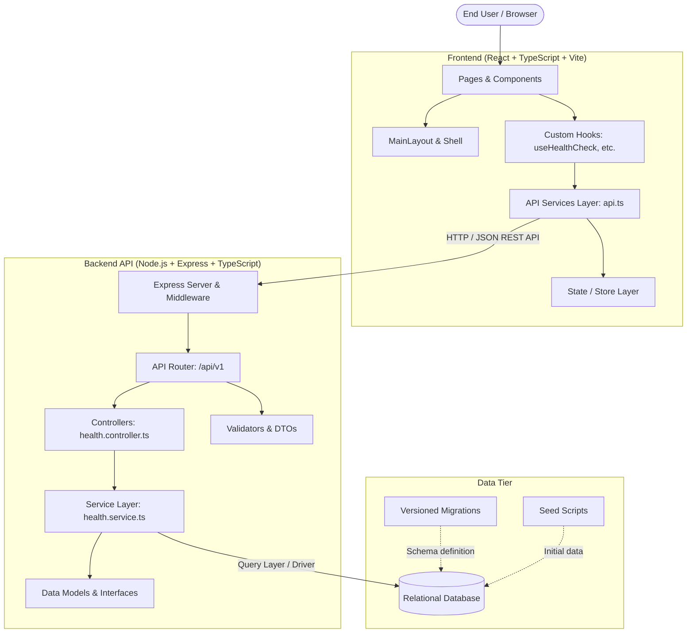

# ReservePulse System Architecture

## Overview
ReservePulse is built on a decoupled **Frontend / Backend / Database** tiered architecture designed for scalability, maintainability, and clean separation of concerns.

## Directory Structure & Responsibilities

### Frontend (`/frontend`)
- **`src/components/`**: Reusable UI components (buttons, cards, badges, modal dialogs).
- **`src/pages/`**: View-level route components (`HomePage`, `NotFoundPage`).
- **`src/layouts/`**: Application scaffolding shells (`MainLayout` with header, navigation, footer).
- **`src/hooks/`**: Custom React hooks encapsulation logic and data fetching (`useHealthCheck`).
- **`src/services/`**: Network communication abstraction and API client configuration (`api.ts`).
- **`src/store/`**: Global state management and stores.
- **`src/utils/`**: Helper utilities, formatting functions, constants.
- **`src/types/`**: TypeScript type definitions and interfaces.
- **`src/assets/`**: Static assets, brand icons, SVG graphics.

### Backend (`/backend`)
- **`src/config/`**: Environment variable parsing, database configuration, security parameters.
- **`src/controllers/`**: Request handling, parameter extraction, and HTTP response formatting.
- **`src/middleware/`**: Cross-cutting concerns (request logging, error interception, CORS, auth).
- **`src/models/`**: Domain models, entity schemas, and core interfaces.
- **`src/routes/`**: Route definitions mapping endpoints to controller handlers.
- **`src/services/`**: Pure business logic, external integrations, and database access.
- **`src/utils/`**: Reusable logging, response envelopes, error classes.
- **`src/validators/`**: Input validation schemas and request validation middleware.

### Database (`/database`)
- **`migrations/`**: Chronological, immutable SQL schema migration files.
- **`seed/`**: Deterministic test and seed datasets for local and staging environments.

### Documentation (`/docs`)
- **`architecture.md`**: Architectural blueprint and component relationships.
- **`api.md`**: API specification and request/response contracts.
- **`setup.md`**: Developer environment setup and execution guides.
