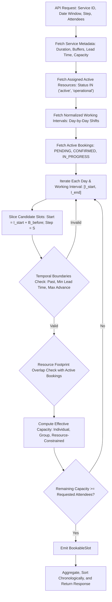

# ReservePulse Slot-Generation & Availability Engine

> Comprehensive specification of the server-side appointment slot generation algorithm, temporal boundary constraints, buffer management, capacity calculation, and multi-resource orchestration.

---

## 1. Executive Summary & Design Principles

The **ReservePulse Slot-Generation Engine** is a high-performance, server-side availability engine that calculates currently bookable appointment slots on-the-fly. It bridges static resource working schedules, dynamic service parameters, existing customer reservations, and capacity rules without duplicating business logic across controllers or frontend views.

### Architectural Tenets:
1. **Server-Side Single Source of Truth**: Availability calculations are never delegated to the client; all temporal filtering, lead times, buffer envelopes, and capacity checks run server-side.
2. **Normalized Availability Decoupling**: The engine consumes clean, normalized working windows exposed by `SchedulingService.getNormalizedAvailability()`, completely separating weekly recurring shift templates from real-time booking calculations.
3. **Strict Non-Overlapping Guarantees**: Working period buffers (`bufferBeforeMinutes`, `bufferAfterMinutes`) are treated as mandatory resource reservation envelopes, ensuring zero collision between setup, session, and teardown periods.
4. **Bookable-Only Contract**: To eliminate unnecessary client-side post-processing, the engine emits only valid, currently bookable slots whose remaining capacity satisfies the requested attendee count.

---

## 2. Mathematical Algorithm & Pipeline



### 2.1. Algorithm Inputs

| Parameter | Notation | Description |
| :--- | :--- | :--- |
| **Service Duration** | $D$ | Duration in minutes of the appointment (e.g. 60 min). |
| **Buffer Before** | $B_{\text{before}}$ | Required preparation/setup minutes on the resource prior to appointment start. |
| **Buffer After** | $B_{\text{after}}$ | Required cleanup/teardown minutes on the resource after appointment end. |
| **Slot Step Size** | $S$ | Step increment between candidate slot start times (defaults to $D$, or configurable e.g. 15, 30 min). |
| **Service Capacity Type** | $\text{type}$ | `'individual'` \| `'group'` \| `'resource_constrained'`. |
| **Service Default Capacity** | $C_{\text{service}}$ | Base maximum seats or units configured on the service. |
| **Resource Capacity** | $C_{\text{resource}}$ | Physical or compute limit of the resource. |
| **Min Lead Time** | $L_{\text{min}}$ | Hours required in advance before appointment start time. |
| **Max Advance Days** | $A_{\text{max}}$ | Maximum horizon in days from reference time allowed for booking. |
| **Requested Attendees** | $A_{\text{req}}$ | Number of attendees requested by the customer (default: 1). |
| **Reference Time** | $T_{\text{now}}$ | Execution timestamp (or deterministic reference time for testing). |

---

### 2.2. Step-by-Step Slicing & Boundary Enforcement

#### Step 1: Resource Working Interval Slicing
For a given day, an eligible resource possesses working intervals $[I_{\text{start}}, I_{\text{end}}]$ in minutes from midnight (0 to 1440).
The total span required for a single appointment is:
$$\text{Span}_{\text{min}} = B_{\text{before}} + D + B_{\text{after}}$$

If $I_{\text{end}} - I_{\text{start}} < \text{Span}_{\text{min}}$, the interval cannot host any slot and is skipped.

Candidate slot start minutes $t_{\text{start}}$ iterate according to:
$$t_{\text{start}} = I_{\text{start}} + B_{\text{before}}, \quad t_{\text{start}} + D + B_{\text{after}} \le I_{\text{end}}, \quad t_{\text{start}} \leftarrow t_{\text{start}} + S$$

Where:
$$t_{\text{end}} = t_{\text{start}} + D$$

#### Step 2: Temporal Boundaries
Every candidate slot is converted to absolute timestamps $[T_{\text{start}}, T_{\text{end}}]$:

1. **Past Time Elimination**:
   $$T_{\text{start}} > T_{\text{now}}$$
   *(Slots in the past are strictly discarded).*

2. **Minimum Lead Time**:
   $$T_{\text{start}} - T_{\text{now}} \ge L_{\text{min}} \times 3600 \text{ seconds}$$
   *(Prevents short-notice bookings).*

3. **Maximum Advance Booking Window**:
   $$T_{\text{start}} - T_{\text{now}} \le A_{\text{max}} \times 86400 \text{ seconds}$$
   *(Prevents booking beyond the organiser's scheduling horizon).*

#### Step 3: Buffer Envelope & Collision Detection
The true physical footprint occupied on the resource is wider than the appointment duration:
$$\text{Footprint} = [T_{\text{start}} - B_{\text{before}}, \; T_{\text{end}} + B_{\text{after}}]$$

An existing booking $B$ collides with the candidate slot if and only if:
$$\text{Status}(B) \in \{\text{'pending'}, \text{'confirmed'}, \text{'in\_progress'}\}$$
$$\text{and } B.\text{start\_time} < (T_{\text{end}} + B_{\text{after}}) \quad \text{and} \quad B.\text{end\_time} > (T_{\text{start}} - B_{\text{before}})$$

Cancelled (`cancelled`) or no-show (`no_show`) bookings are explicitly excluded from consumption.

#### Step 4: Capacity Matrix & Bookability Evaluation
Effective maximum capacity $C_{\text{max}}$ depends on the service's capacity model:

$$C_{\text{max}} = \begin{cases} 
1 & \text{if } \text{type} = \text{'individual'} \\
\min(C_{\text{service}}, C_{\text{resource}}) & \text{if } \text{type} = \text{'resource\_constrained'} \\
C_{\text{service}} & \text{if } \text{type} = \text{'group'}
\end{cases}$$

The total booked attendee count across all overlapping bookings is:
$$\text{BookedCount} = \sum_{B \in \text{Colliding}} B.\text{attendee\_count}$$

The remaining capacity is:
$$C_{\text{remaining}} = \max(0, \; C_{\text{max}} - \text{BookedCount})$$

The slot is deemed **currently bookable** if:
$$\text{IsBookable} = (C_{\text{remaining}} \ge A_{\text{req}}) \;\land\; (C_{\text{remaining}} > 0)$$

Slots where $\text{IsBookable} = \text{false}$ are pruned from the returned payload.

---

## 3. Multi-Resource Orchestration

A single bookable service may be mapped to multiple resources in `service_resources` (e.g., 2 private meeting rooms, or 3 clinical specialists).

1. **Pooled Availability**: If no `resourceId` filter is supplied, the engine evaluates all active assigned resources. If Resource A and Resource B are both free at 10:00 AM, separate bookable slots for each resource are emitted.
2. **Selective Resource Query**: When the customer or organiser selects a specific resource (`?resourceId=res_xyz`), the engine restricts candidate generation strictly to that resource.
3. **Resource State Isolation**: If Resource A is placed in `maintenance` or is inactive, its availability collapses to 0 while Resource B continues serving bookable slots unaffected.

---

## 4. API Endpoints & Contract Specifications

### Endpoints:
- `GET /api/v1/services/:id/availability`
- `GET /api/v1/availability/services/:serviceId`

### Query Parameters:
| Parameter | Type | Required | Default | Description |
| :--- | :--- | :--- | :--- | :--- |
| `startDate` | string | **Yes** | — | Start date in `YYYY-MM-DD` format. |
| `endDate` | string | **Yes** | — | End date in `YYYY-MM-DD` format (max 90-day window). |
| `resourceId` | string | No | All | Filter availability to a specific assigned resource. |
| `slotStep` | integer | No | $D$ | Custom step increment between slot start times in minutes (5 to 480). |
| `attendees` | integer | No | `1` | Capacity threshold required for candidate slots. |
| `shareToken` | string | No | — | Allows previewing availability for unpublished/draft services. |

### Sample Response (`200 OK`):
```json
{
  "success": true,
  "statusCode": 200,
  "message": "Available appointment slots retrieved for \"High-Density Compute Allocation\" (23 slots bookable)",
  "data": {
    "service": {
      "id": "srv_comp_001",
      "name": "High-Density Compute Allocation",
      "slug": "high-density-compute-allocation",
      "durationMinutes": 60,
      "bufferBeforeMinutes": 10,
      "bufferAfterMinutes": 15,
      "capacityType": "resource_constrained",
      "defaultCapacity": 4,
      "minLeadTimeHours": 2,
      "maxAdvanceBookingDays": 30
    },
    "query": {
      "startDate": "2026-10-12",
      "endDate": "2026-10-12",
      "slotStepMinutes": 60,
      "attendeeCount": 1
    },
    "totalBookableSlots": 23,
    "days": [
      {
        "date": "2026-10-12",
        "dayOfWeek": 1,
        "dayName": "Monday",
        "hasAvailability": true,
        "totalSlotsCount": 23,
        "slots": [
          {
            "id": "slt_res_h100_node1_2026-10-12_0810_0910",
            "serviceId": "srv_comp_001",
            "resourceId": "res_h100_node1",
            "resourceName": "GPU Cluster Node 01 (8x H100)",
            "resourceType": "compute",
            "date": "2026-10-12",
            "startTime": "08:10",
            "endTime": "09:10",
            "startDateTime": "2026-10-12T08:10:00.000Z",
            "endDateTime": "2026-10-12T09:10:00.000Z",
            "durationMinutes": 60,
            "maxCapacity": 4,
            "bookedCapacity": 0,
            "remainingCapacity": 4,
            "isBookable": true,
            "status": "available"
          }
        ]
      }
    ]
  },
  "timestamp": "2026-09-25T01:30:00.000Z"
}
```

---

## 5. Verification & Test Coverage Matrix

The engine is covered by an automated test suite ([test_slot_engine.ts](file:///c:/Users/rudar/OneDrive/Desktop/ReservePulse/backend/src/scripts/test_slot_engine.ts)) with **89/89 automated assertions passing**:

| Test Category | Invariant Verified |
| :--- | :--- |
| **Boundaries** | Working interval start/end strict boundaries; slot duration matching; rejection of past slots; rejection of slots within lead time horizon; rejection of dates beyond max advance days. |
| **Overlapping Conflicts** | Exact booking overlaps zero out capacity; partial overlaps with setup/cleanup buffers exclude colliding slots; adjacent non-buffered slots remain bookable; cancelled bookings release capacity. |
| **Unavailable Resources** | Inactive/maintenance resources return 0 slots; weekend off-days return 0 slots; requesting unassigned resource returns 0 slots; multi-resource isolation preserves active providers. |
| **Capacity Handling** | Individual appointment $(C=1)$ exclusion upon 1 booking; group appointment partial occupancy $(4 - 2 = 2)$; exclusion when requested attendees $(A_{\text{req}}=3)$ exceed remaining $(2)$. |
| **Configurable Slots** | Rolling step size $(S=30\text{m})$ produces dense staggered slot matrices; multi-resource pooling outputs distinct resource slots. |
| **HTTP API Integration** | HTTP 200 on public endpoints; HTTP 422 on inverted date ranges; HTTP 422 on ranges $> 90$ days; HTTP 404 on unpublished drafts; HTTP 200 with valid `shareToken`. |
