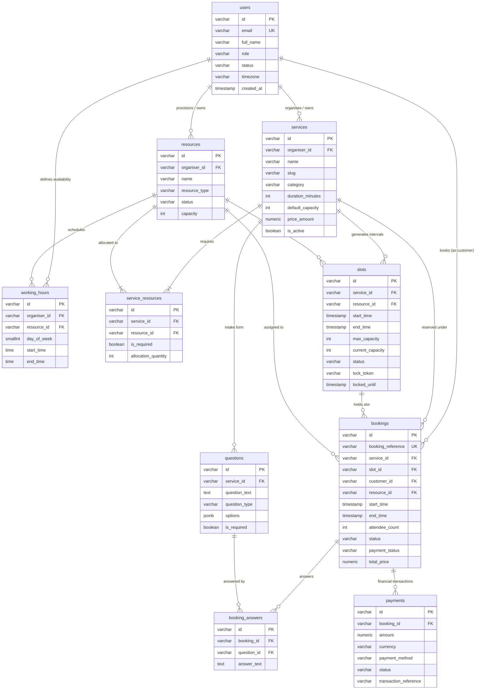

# ReservePulse PostgreSQL Database Schema

> High-resilience, multi-provider reservation and resource orchestration schema for PostgreSQL.

---

## 1. Overview & Architectural Principles

The ReservePulse database schema is engineered for **strict ACID transaction isolation**, **zero scheduling collisions**, **multi-provider multi-resource scaling**, and **flexible appointment capacity**.

### Key Architectural Tenets:
* **Multi-Provider / Multi-Organiser Partitioning**: All bookable services and physical/computational resources belong to an organiser (`organiser_id`), allowing clean multi-tenant isolation.
* **Many-to-Many Resource Allocation**: Services bind to one or more physical or computational resources (`service_resources`), supporting complex setups (e.g. 1 Boardroom + 1 Telepresence Kit, or GPU clusters).
* **Flexible Appointment Capacities**: Supports 1-on-1 private appointments, shared conference capacities (e.g. 16 seats in a boardroom), and resource-constrained allocations.
* **ACID Concurrency Locking Engine**: The `slots` entity incorporates distributed temporary lock tokens (`lock_token`, `locked_until`) enabling race-free checkout with automatic timeout release.
* **Comprehensive Audit & Financial Ledger**: Dedicated `bookings`, `booking_answers`, and `payments` tables with full timestamp auditing and state transitions.

---

## 2. Entity-Relationship (ER) Diagram



---

## 3. Schema Entities & Data Contracts

### 3.1. `users`
Foundation identity table representing all system participants.
* **Primary Key**: `id VARCHAR(36)`
* **Key Fields**:
  * `email VARCHAR(255) UNIQUE NOT NULL`
  * `full_name VARCHAR(255) NOT NULL`
  * `role VARCHAR(50) NOT NULL` (`customer`, `organiser`, `admin`, `user`)
  * `status VARCHAR(50) DEFAULT 'active' NOT NULL` (`active`, `inactive`, `suspended`)
  * `phone VARCHAR(50)`, `timezone VARCHAR(50) DEFAULT 'UTC'`
  * `metadata JSONB`
* **Indexes**: `idx_users_email`, `idx_users_role`, `idx_users_status`.

### 3.2. `services`
Bookable offerings published by organisers.
* **Primary Key**: `id VARCHAR(36)`
* **Foreign Keys**: `organiser_id REFERENCES users(id) ON DELETE CASCADE`
* **Key Fields**:
  * `name VARCHAR(255) NOT NULL`, `slug VARCHAR(255) NOT NULL`
  * `category VARCHAR(100)` (`workspace`, `compute`, `consultation`, `hardware`)
  * `duration_minutes INT NOT NULL CHECK (duration_minutes > 0)`
  * `buffer_before_minutes INT`, `buffer_after_minutes INT`
  * `price_amount NUMERIC(10, 2)`, `price_currency VARCHAR(3)`
  * `capacity_type VARCHAR(50)` (`individual`, `group`, `resource_constrained`)
  * `default_capacity INT NOT NULL CHECK (default_capacity > 0)`
  * `max_advance_booking_days INT`, `min_lead_time_hours INT`
* **Constraints**: `UNIQUE (organiser_id, slug)`
* **Indexes**: `idx_services_organiser`, `idx_services_category`, `idx_services_is_active`.

### 3.3. `resources`
Concrete physical and computational entities that fulfill reservations.
* **Primary Key**: `id VARCHAR(36)`
* **Foreign Keys**: `organiser_id REFERENCES users(id) ON DELETE CASCADE`
* **Key Fields**:
  * `name VARCHAR(255) NOT NULL`
  * `resource_type VARCHAR(100) NOT NULL` (`room`, `compute`, `pod`, `studio`, `equipment`)
  * `location VARCHAR(255)`, `capacity INT NOT NULL CHECK (capacity > 0)`
  * `status VARCHAR(50)` (`operational`, `maintenance`, `decommissioned`)
* **Indexes**: `idx_resources_organiser`, `idx_resources_type`, `idx_resources_status`.

### 3.4. `service_resources`
Many-to-many junction binding services to required or optional resources.
* **Primary Key**: `id VARCHAR(36)`
* **Foreign Keys**: `service_id REFERENCES services(id)`, `resource_id REFERENCES resources(id)`
* **Key Fields**: `is_required BOOLEAN`, `allocation_quantity INT CHECK (allocation_quantity > 0)`
* **Constraints**: `UNIQUE (service_id, resource_id)`
* **Indexes**: `idx_service_resources_service`, `idx_service_resources_resource`.

### 3.5. `working_hours`
Weekly recurring schedule definition for providers and resources.
* **Primary Key**: `id VARCHAR(36)`
* **Foreign Keys**: `organiser_id REFERENCES users(id)`, `resource_id REFERENCES resources(id)`
* **Key Fields**:
  * `day_of_week SMALLINT CHECK (day_of_week BETWEEN 0 AND 6)` (0 = Sunday, 6 = Saturday)
  * `start_time TIME NOT NULL`, `end_time TIME NOT NULL`
  * `is_available BOOLEAN DEFAULT true`
* **Constraints**: `CHECK (start_time < end_time)`, `CHECK (organiser_id IS NOT NULL OR resource_id IS NOT NULL)`
* **Indexes**: `idx_working_hours_organiser`, `idx_working_hours_resource`.

### 3.6. `slots`
Discrete reservation intervals with capacity metrics and concurrency lock tokens.
* **Primary Key**: `id VARCHAR(36)`
* **Foreign Keys**: `service_id REFERENCES services(id)`, `resource_id REFERENCES resources(id)`
* **Key Fields**:
  * `start_time TIMESTAMP WITH TIME ZONE`, `end_time TIMESTAMP WITH TIME ZONE`
  * `max_capacity INT`, `current_capacity INT`
  * `status VARCHAR(50)` (`available`, `locked`, `booked`, `cancelled`, `unavailable`)
  * `lock_token VARCHAR(255)`, `locked_until TIMESTAMP WITH TIME ZONE`
* **Constraints**: `CHECK (start_time < end_time)`, `CHECK (current_capacity <= max_capacity)`
* **Indexes**: `idx_slots_service_start`, `idx_slots_resource_start`, `idx_slots_status`, `idx_slots_lock_query`.

### 3.7. `questions`
Intake questionnaire forms associated with bookable services.
* **Primary Key**: `id VARCHAR(36)`
* **Foreign Keys**: `service_id REFERENCES services(id) ON DELETE CASCADE`
* **Key Fields**:
  * `question_text TEXT NOT NULL`
  * `question_type VARCHAR(50)` (`text`, `textarea`, `select`, `checkbox`, `number`)
  * `options JSONB DEFAULT '[]'::jsonb`, `is_required BOOLEAN`, `order_index INT`
* **Indexes**: `idx_questions_service_order`.

### 3.8. `bookings`
The primary reservation ledger contract.
* **Primary Key**: `id VARCHAR(36)`
* **Key Fields**:
  * `booking_reference VARCHAR(50) UNIQUE NOT NULL`
  * `service_id REFERENCES services(id) ON DELETE RESTRICT`
  * `slot_id REFERENCES slots(id) ON DELETE SET NULL`
  * `customer_id REFERENCES users(id) ON DELETE SET NULL`
  * `resource_id REFERENCES resources(id) ON DELETE SET NULL`
  * `start_time TIMESTAMP WITH TIME ZONE`, `end_time TIMESTAMP WITH TIME ZONE`
  * `attendee_count INT DEFAULT 1 CHECK (attendee_count > 0)`
  * `status VARCHAR(50)` (`pending`, `confirmed`, `in_progress`, `completed`, `cancelled`, `no_show`)
  * `payment_status VARCHAR(50)` (`unpaid`, `pending`, `paid`, `refunded`, `failed`)
  * `total_price NUMERIC(10, 2)`, `price_currency VARCHAR(3)`
  * `guest_name`, `guest_email`, `guest_phone`, `notes`
  * `cancelled_at TIMESTAMP WITH TIME ZONE`, `cancelled_by VARCHAR(36)`
* **Indexes**: `idx_bookings_reference`, `idx_bookings_service`, `idx_bookings_customer`, `idx_bookings_status`, `idx_bookings_start_end`.

### 3.9. `booking_answers`
Customer answers to service intake questions.
* **Primary Key**: `id VARCHAR(36)`
* **Foreign Keys**: `booking_id REFERENCES bookings(id) ON DELETE CASCADE`, `question_id REFERENCES questions(id) ON DELETE CASCADE`
* **Key Fields**: `answer_text TEXT NOT NULL`
* **Constraints**: `UNIQUE (booking_id, question_id)`
* **Indexes**: `idx_booking_answers_booking`, `idx_booking_answers_question`.

### 3.10. `payments`
Financial audit ledger tracking transaction attempts, gateway references, and refunds.
* **Primary Key**: `id VARCHAR(36)`
* **Foreign Keys**: `booking_id REFERENCES bookings(id) ON DELETE CASCADE`
* **Key Fields**:
  * `amount NUMERIC(10, 2) NOT NULL CHECK (amount > 0)`, `currency VARCHAR(3)`
  * `payment_method VARCHAR(50)` (`credit_card`, `stripe`, `paypal`, `credits`)
  * `transaction_reference VARCHAR(255)`, `status VARCHAR(50)` (`pending`, `completed`, `failed`, `refunded`)
  * `refund_amount NUMERIC(10, 2) DEFAULT 0.00`
  * `gateway_response JSONB`, `paid_at TIMESTAMP WITH TIME ZONE`
* **Indexes**: `idx_payments_booking`, `idx_payments_transaction_ref`, `idx_payments_status`.

---

## 4. Concurrency Locking & Race-Condition Safeguards

To prevent double bookings during peak demand, the schema supports two-phase lock acquisition:

1. **Lock Phase**: When a user selects a timeslot during checkout:
   ```sql
   UPDATE slots
   SET status = 'locked',
       lock_token = :token,
       locked_until = CURRENT_TIMESTAMP + INTERVAL '5 minutes'
   WHERE id = :slot_id
     AND (status = 'available' OR (status = 'locked' AND locked_until < CURRENT_TIMESTAMP))
     AND current_capacity < max_capacity;
   ```
2. **Commit Phase**: When payment or confirmation completes:
   ```sql
   UPDATE slots
   SET current_capacity = current_capacity + :attendee_count,
       status = CASE WHEN current_capacity + :attendee_count >= max_capacity THEN 'booked' ELSE 'available' END,
       lock_token = NULL,
       locked_until = NULL
   WHERE id = :slot_id AND lock_token = :token;
   ```

---

## 5. Migration Execution & Seed Usage

### Applying Migrations
Execute versioned scripts in sequential order against your PostgreSQL instance:
```bash
# 1. Foundation schema
psql -d reservepulse -f database/migrations/001_initial_schema.sql

# 2. Complete reservation & resource schema
psql -d reservepulse -f database/migrations/002_reservepulse_schema.sql
```

### Seeding Development Data
Load deterministic test data for local development and QA:
```bash
psql -d reservepulse -f database/seed/seed.sql
```
