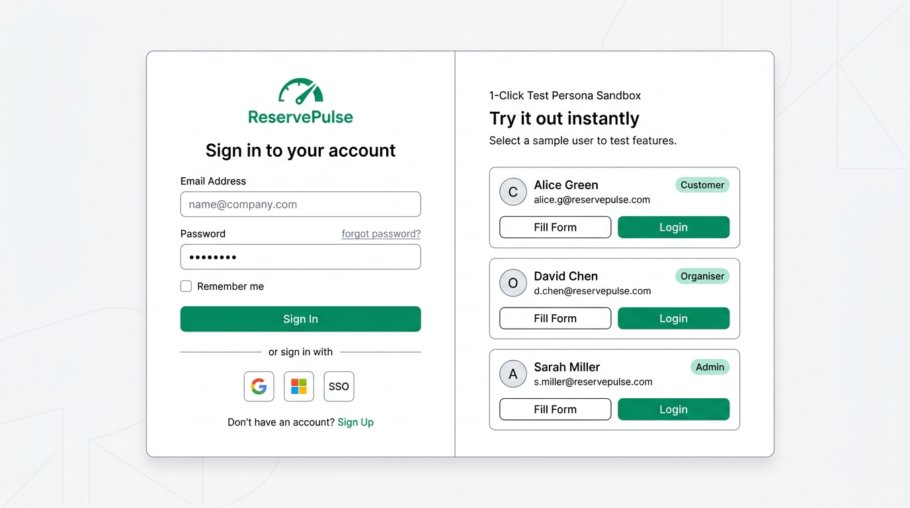
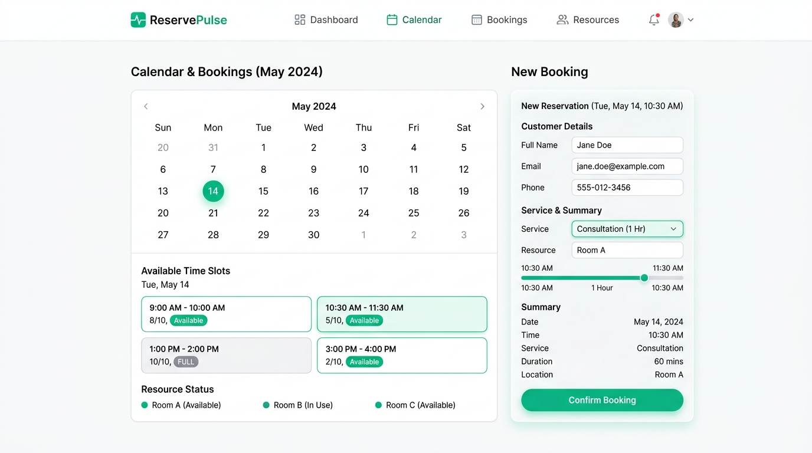
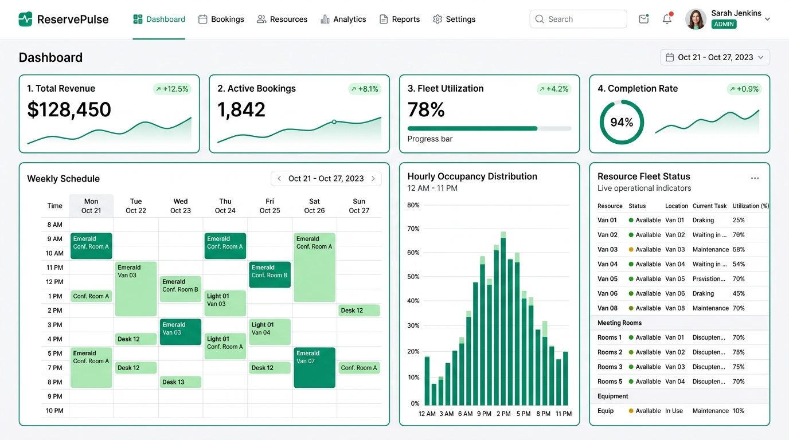

# ReservePulse - UI/UX Wireframe & Layout Architecture

> **Design System**: Signature White & Emerald Green Glassmorphic UI  
> **Target Framework**: React 19 + TypeScript + Tailwind CSS 4.0  
> **Asset Storage**: Stored locally in [`docs/wireframes/`](./wireframes/)

---

## 🎨 1. Authentication & 1-Click Testing Sandbox Wireframe



### Layout Hierarchy & Architecture

```text
+---------------------------------------------------------------------------------------------------------+
| [Master Card: max-w-5xl, bg-white/95, border-emerald-200/90, rounded-3xl, shadow-2xl]                   |
|                                                                                                         |
| LEFT COLUMN: Form (5 Cols / 42%)                  RIGHT COLUMN: Testing Sandbox (7 Cols / 58%)          |
| +----------------------------------------------+  +---------------------------------------------------+ |
| | [Logo] ReservePulse                          |  | (•) INSTANT DEMO TEST PERSONAS   [🍪 Cookie DB]   | |
| |                                              |  | Pick any role below to test full capabilities:    | |
| | Welcome back                                 |  |                                                   | |
| | Sign in to manage schedules or inspect.      |  | +-----------------------------------------------+ | |
| |                                              |  | | [👤] Alex Morgan              [Client Portal] | | |
| | Email Address:                               |  | | customer@reservepulse.com                     | | |
| | [ name@example.com                         ] |  | | Browse catalog, select slots & intake forms.  | | |
| |                                              |  | | [ Fill Form ]             [ Login → (Green) ] | | |
| | Password:                 (Default: Role@123)|  | +-----------------------------------------------+ | |
| | [ ••••••••••••••••                         ] |  |                                                   | |
| |                                              |  | +-----------------------------------------------+ | |
| | +------------------------------------------+ |  | | [💼] Jordan Vance          [Operations Fleet] | | |
| | |      SIGN IN TO PLATFORM (Primary)       | |  | | organiser@reservepulse.com                    | | |
| | +------------------------------------------+ |  | | Publish services, manage resources & shifts. | | |
| |                                              |  | | [ Fill Form ]             [ Login → (Green) ] | | |
| | New to platform? Sign up    ← Return to Home |  | +-----------------------------------------------+ | |
| |                                              |  |                                                   | |
| |                                              |  | +-----------------------------------------------+ | |
| |                                              |  | | [🛡️] Morgan Reed              [Full Access]   | | |
| |                                              |  | | admin@reservepulse.com                        | | |
| |                                              |  | | Platform analytics, users & audit logs.       | | |
| |                                              |  | | [ Fill Form ]             [ Login → (Green) ] | | |
| |                                              |  | +-----------------------------------------------+ | |
| |                                              |  |                                                   | |
| |                                              |  | 💾 Data persists in Cookies.    [Reset Demo Data] | |
| +----------------------------------------------+  +---------------------------------------------------+ |
+---------------------------------------------------------------------------------------------------------+
```

---

## 📅 2. Interactive Booking Wizard & Dynamic Slot Grid Wireframe



### Component Specifications

```text
+---------------------------------------------------------------------------------------------------------+
| [Logo] ReservePulse         [Dashboard]  [Calendar]  [Bookings]  [Resources]            (🔔) [Profile]  |
+---------------------------------------------------------------------------------------------------------+
|                                                                                                         |
| LEFT PANEL: Calendar & Real-Time Availability (60%)     RIGHT PANEL: Intake Form & Summary (40%)        |
| +-----------------------------------------------------+ +---------------------------------------------+ |
| | < May 2024 >                                        | | New Reservation (Tue, May 14, 10:30 AM)     | |
| | Sun   Mon   Tue   Wed   Thu   Fri   Sat             | |                                             | |
| | 12    13   (14)    15    16    17    18             | | Customer Details                            | |
| +-----------------------------------------------------+ | Full Name:  [ Jane Doe                    ] | |
| | Available Time Slots (May 14)                       | | Email:      [ jane.doe@example.com        ] | |
| | +-----------------------+ +-----------------------+ | | Phone:      [ +1 555-012-3456             ] | |
| | | 09:00 AM - 10:00 AM   | | 10:30 AM - 11:30 AM   | | |---------------------------------------------| |
| | | [Available]  8/10 cap | | [Selected]   5/10 cap | | | Service & Questionnaire                     | |
| | +-----------------------+ +-----------------------+ | | Service:    [ Consultation (1 Hr)       v ] | |
| | +-----------------------+ +-----------------------+ | | Resource:   Executive Boardroom Alpha       | |
| | | 01:00 PM - 02:00 PM   | | 03:00 PM - 04:00 PM   | | | Duration:   60 mins (Buffers: 15m before)   | |
| | | [FULL]      10/10 cap | | [Available]  2/10 cap | | | Price:      $45.00                          | |
| | +-----------------------+ +-----------------------+ | |---------------------------------------------| |
| |                                                     | | +-----------------------------------------+ | |
| | Resource Status:                                    | | |        CONFIRM BOOKING (CTA)            | | |
| | (•) Room A (Available)  (•) Room B (In Use)         | | +-----------------------------------------+ | |
| +-----------------------------------------------------+ +---------------------------------------------+ |
+---------------------------------------------------------------------------------------------------------+
```

---

## 📊 3. Executive Telemetry & Fleet Operations Dashboard Wireframe



### Dashboard Layout Hierarchy
1. **Top Metric Strip (4 KPI Summary Cards)**:
   - **Total Revenue**: `$128,450` (`+12.5%` vs. previous period)
   - **Active Bookings**: `1,842` (`+8.1%` growth trendline)
   - **Fleet Utilization**: `78%` (with linear progress indicator)
   - **Completion Rate**: `94%` (circular gauge indicating non-cancelled appointments)
2. **Operational Schedule Matrix (Left)**:
   - Weekly time-blocked calendar (Mon–Sun, 08:00 AM – 10:00 PM) showing confirmed bookings.
3. **Hourly Occupancy Distribution (Center)**:
   - 24-hour histogram visualizing load concentration (busiest window: 02:00 PM – 04:00 PM).
4. **Live Resource Fleet Status (Right)**:
   - Real-time status list (`Operational`, `Maintenance`, `In Use`) with utilization percentages.

---

## 📐 Design Tokens & Visual Specs

| Token | CSS / Hex | Purpose |
| :--- | :--- | :--- |
| **Brand Primary** | `#059669` (`emerald-600`) | Main buttons, active tabs, indicator dots |
| **Brand Accent** | `#047857` (`emerald-700`) | Hover states, active borders |
| **Soft Surface Tint** | `#ECFDF5` (`emerald-50`) | Card backgrounds, badge fills, ambient mesh |
| **Surface White** | `#FFFFFF` (`white/95`) | Clean glassmorphic cards, inputs, dialogs |
| **Border Soft** | `#A7F3D0` (`emerald-200`) | Card borders, dividers, focus rings |
| **Text Heading** | `#0F172A` (`slate-900`) | Main titles, user names, primary labels |
| **Text Body** | `#334155` (`slate-700`) | Descriptions, table cells, form labels |
| **Text Muted** | `#64748B` (`slate-500`) | Subtitles, helper text, timestamps |

---

## 📱 Responsive Breakpoints

- **Desktop (`>= 1024px`)**: Full 2-column balanced split (5 cols / 7 cols) for Auth, side-by-side for booking wizard (60% / 40%), 4-column KPI strip.
- **Tablet (`768px - 1023px`)**: 2-column grid for KPIs, stacked cards with generous padding.
- **Mobile (`< 768px`)**: Single column stacked flow, tap-friendly action targets (min 44px height), full-width buttons.
